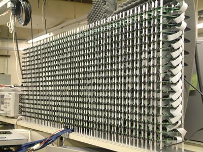

# Near-Field-Acoustic-Holography
An Matlab implementation of a fft based near-field acoustic holography algorithm (NAH)

## Concept

We implement here an acoustic near field algorithm which shift the z-axis in the frequency domain. The input data came from the LOUD microphone array where the input data is public available, at least in the waback internet archive. The raw data for the array is  available as CSV files which are converted in multi channel wave files which is re-opened. Once the conversion is completed we can only use the wave file. The geometry data for the array is also available and is used in the getArrayFromRawInput function to extract one spund-preassure-level (SPL) array which is aligned in the correct order of the microphone channels corresponding to the array coordinates. This function returns one X-Y array with the SPL at for ine sample time. The recorded singal is 48000 samples long with an samplerate of 16000 1/s and a length of 3 seconds. This means that the getArrayFromRawInput delivers a two dimensional marirx from the array for each time sample point. The main algorithm lops over the time samples and extracts a 3D matrix for each sample point which is used to generate the slice plot which is stored on disc. So theoretical it is possible to generate a time lapse image sequence from 48000 images. The main algorith transforms the 2D array in the frequency domain, and shifts the signal in the z-achsis for each sample point. The LOUD array has a dimension of 60 x 17 = 1020 microphones. The 2D gaussian window function can be used as spatial low pass in the frequency domain. The NAH-algorithm generates for each time sample from the array an 3D hologram from the shifted z-axis.

## The LOUD microphone array from the MIT

